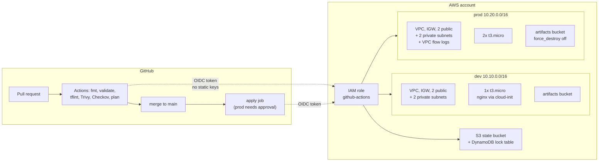

# terraform-aws-foundation

Multi-environment AWS infrastructure as code: reusable Terraform modules, isolated `dev` and `prod` state, and a GitHub Actions pipeline that lints, security-scans, plans on every pull request, and applies through OIDC with no stored AWS keys.

Built to run inside the AWS free tier. Every resource that costs money is behind a flag that defaults to off.

---

## Architecture



Full write-up, including the decisions behind the topology: [`docs/architecture.md`](docs/architecture.md).

---

## Repository layout

```
bootstrap/          One-time per account: state bucket, lock table, CI OIDC role
modules/
  vpc/              VPC, IGW, public + private subnets, optional NAT and flow logs
  security-group/   Security group with a guard rail against SSH open to the world
  ec2/              Instance with SSM access, IMDSv2 enforced, encrypted gp3 root
  s3-bucket/        Versioned, encrypted, TLS-only, public access blocked
envs/
  dev/              10.10.0.0/16, 1 instance, cost controls off
  prod/             10.20.0.0/16, 2 instances, flow logs on, state protected
scripts/            cloud-init user data
.github/workflows/  CI pipeline
```

Modules never hardcode an environment. Environments never declare a raw resource. That separation is what makes adding a third environment a 20-line change.

---

## Getting started

Prerequisites: Terraform >= 1.6, AWS CLI v2, an AWS account, and credentials with administrator access for the bootstrap step only.

**1. Create the state backend and CI role** (once per AWS account):

```bash
cd bootstrap && terraform init && terraform apply
```

Note the two outputs: `state_bucket` and `github_actions_role_arn`.

**2. Point the environments at that bucket:**

```bash
sed -i "s/REPLACE_WITH_ACCOUNT_ID/$(aws sts get-caller-identity --query Account --output text)/" envs/*/backend.hcl
```

**3. Restrict access to your own IP** — edit `admin_cidr` in `envs/dev/terraform.tfvars`:

```bash
echo "admin_cidr = \"$(curl -s ifconfig.me)/32\""
```

**4. Plan and apply:**

```bash
make init ENV=dev && make plan ENV=dev && make apply ENV=dev
```

**5. Tear it down when you are done** — this is a lab, not a service:

```bash
make destroy ENV=dev
```

`make help` lists every target.

---

## CI/CD pipeline

| Stage | Tool | Runs on | Blocks merge |
|---|---|---|---|
| Formatting | `terraform fmt -check` | every push and PR | yes |
| Validation | `terraform validate` (all 3 dirs) | every push and PR | yes |
| Linting | tflint + AWS ruleset | every push and PR | yes |
| IaC security | Trivy config scan, HIGH/CRITICAL | every push and PR | yes |
| Policy scan | Checkov, results to the security tab | every push and PR | no, advisory |
| Plan | `terraform plan`, posted as a PR comment | pull requests | no |
| Apply | `terraform apply` | merge to main, or manual dispatch | prod requires reviewer approval |

Trivy findings are uploaded as SARIF, so they appear in the GitHub **Security** tab rather than being buried in log output. The plan comment is updated in place instead of appended, so a long-running PR does not accumulate a wall of stale plans.

### Why OIDC

The alternative is storing an `AWS_ACCESS_KEY_ID` and `AWS_SECRET_ACCESS_KEY` as repository secrets — credentials that never expire and grant the same access to anyone who can read them or trick a workflow into echoing them. With OIDC, GitHub mints a token scoped to this repository, AWS exchanges it for credentials that expire in an hour, and the trust policy pins the `sub` claim to `repo:OWNER/terraform-aws-foundation:*`. There is no secret to rotate because there is no secret.

---

## Security decisions

These are the choices that a scanner would otherwise flag, made deliberately:

- **IMDSv2 required** on every instance. IMDSv1 is what turns a routine SSRF bug into stolen instance credentials.
- **No SSH.** Instances have no key pair and no port 22. Access is through SSM Session Manager, which logs every session to CloudTrail. The security group module *rejects* a rule opening 22 to `0.0.0.0/0` at plan time via a variable validation, rather than trusting review to catch it.
- **TLS-only bucket policy.** An S3 bucket serves plaintext HTTP unless explicitly denied.
- **Encryption everywhere** — EBS root volumes, S3 objects, DynamoDB, all at rest by default.
- **`prevent_destroy`** on the state bucket and lock table. Losing state is worse than losing infrastructure.
- **Public access block** on every bucket, independent of the bucket policy, because the two controls fail differently.

## Cost controls

The default configuration stays inside the AWS free tier. The expensive resources are opt-in:

| Resource | Default | Cost when enabled |
|---|---|---|
| NAT gateway | off | ~$32/month plus data processing |
| VPC flow logs | off in dev, on in prod | CloudWatch ingestion per GB |
| Detailed monitoring | off | $2.10/instance/month |
| EC2 | `t3.micro` | free tier: 750 hours/month for 12 months |

Private subnets exist with no NAT route by default. That is intentional — the network design is production-shaped and can be promoted by flipping one flag, without restructuring the address plan.

---

## Known limitations

Honest list, because a portfolio project that claims to be production-ready is a portfolio project nobody believes:

- The CI role uses AWS managed policies (`AmazonEC2FullAccess` and friends). A real deployment would scope this to the specific actions the plan needs, generated from CloudTrail data.
- No remote state encryption with a customer-managed KMS key — SSE-S3 only, to stay free.
- Application instances sit in public subnets with public IPs. With a NAT gateway or VPC endpoints they would move to private subnets; the module already supports it.
- No automated tests. Terratest or `terraform test` over the modules is the obvious next step.
